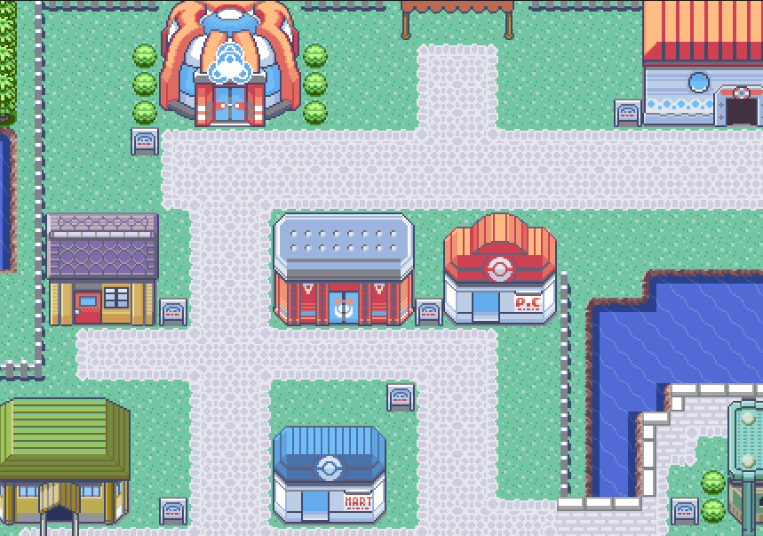
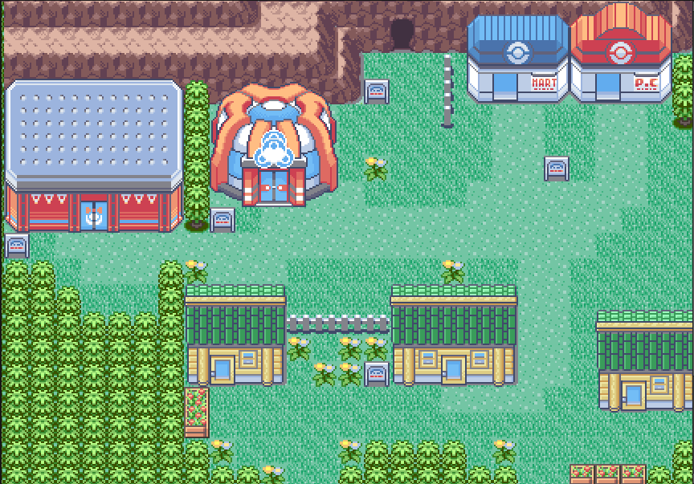
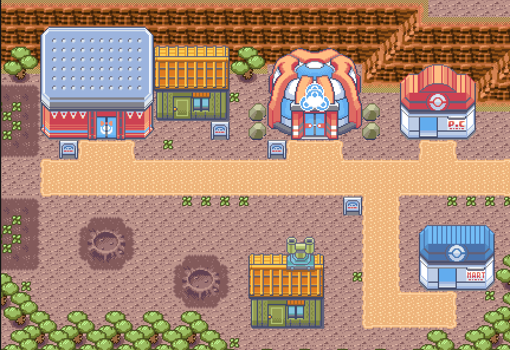

# Pokémon Emerald

### Slateport City Contest Hall

### Verdanturf Town Contest Hall

### Fallarbor Town Contest Hall

## Additions
1. Slateport City, Verdanturf Town and Fallarbor Town Contest Halls re-added

2. RTC Seed RNG has been fixed.

### Note: This is a fork of Pret's Pokeemerald
Official repository of pret [here](https://github.com/pret/pokeemerald)

This is a decompilation of Pokémon Emerald.

It builds the following ROM:

* [**pokeemerald.gba**](https://datomatic.no-intro.org/index.php?page=show_record&s=23&n=1961) `sha1: f3ae088181bf583e55daf962a92bb46f4f1d07b7`

To set up the repository, see [INSTALL.md](INSTALL.md).

For contacts and other pret projects, see [pret.github.io](https://pret.github.io/).
